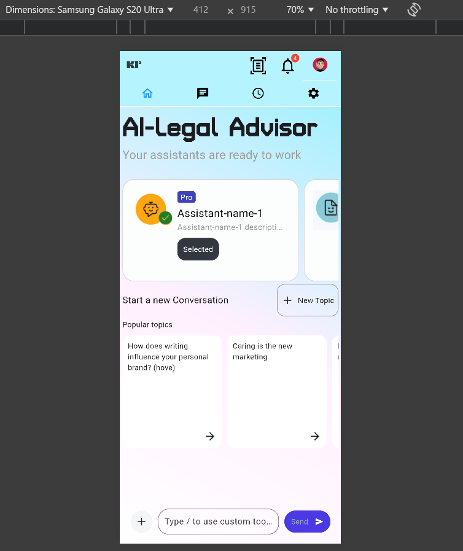

# Responsive Flutter Demo Project

This Flutter demo project that adapt UI for mobile, tablet, and desktop screens. By using custom layout design, breaking points and extension. The app dynamically adjusts its layout and components based on the screen size, providing an optimal user experience across devices.
# Architecture
- Flutter MVVM architecture

### File Descriptions:

- **_model/**: Contains data models and business logic for the app, such as classes to represent data and other entities.
- **_screen/**: This file is divided by device type (mobile, tablet, desktop) and contains the UI components. It also includes shared widgets that can be reused across different layouts.
- **_VM**: Responsible for managing application state using `ReactiveValueNotifier`. The ViewModel interacts with the services and provides the data to the views.
- **responsive_layout.dart**: The entry point of the application, where the `MaterialApp` is initialized, and responsive breakpoints are set up.
- **routes.dart**: Defines the named routes for navigation across different screens in the app.
- **values.dart**: Contains frequently used values/colors/fonts
- **extensions.dart**: contains custom logic(ratio-pixel) for adaptive device screen.
- **\architecture**: MVVM architecture
- **\registry**: MVVM architecture model registry to viewmodel
-  **\pages**: This dir contain all pages & each page directory contains minnimum 3 file(Screen,model,ViewModel)

## Features

- **Responsive UI**: Automatically adjusts layouts for different screen sizes (mobile, tablet, desktop).
- **Adaptive Layouts**: Different UI layouts for mobile, tablet, and desktop using `Custom extension `.
- **Screen Size Handling**:custom extension screen scaling and breakpoints.
# Required figma design for Project
- https://www.figma.com/design/IBaajgBoemhqpZpeKxBPpJ/Codia-AI-Design%3A-Screenshot-to-Editable-Figma-Design-(Community)?node-id=0-1&m=dev&t=gdM0pAd1lTdW8bUI-1

# Required design for Project

# some devloped UI layout for different screen

## Limitations

- **Font**: The required font(s) specified in the project isn't exactly found.
- **Icon**: Some icons are used by screenshot so there is some glitch in Ui, and some icons are use from flutter icon that are not exactly same.
- **Breaking points**: Breaking points may different and need modification in extension for adaptive UI.
- **Testing**: need more testing for UI error found
- **Design Limitations**: The required design is provided only for desktop. Mobile and tablet interfaces have been built based on assumptions, which may not align perfectly.
  
